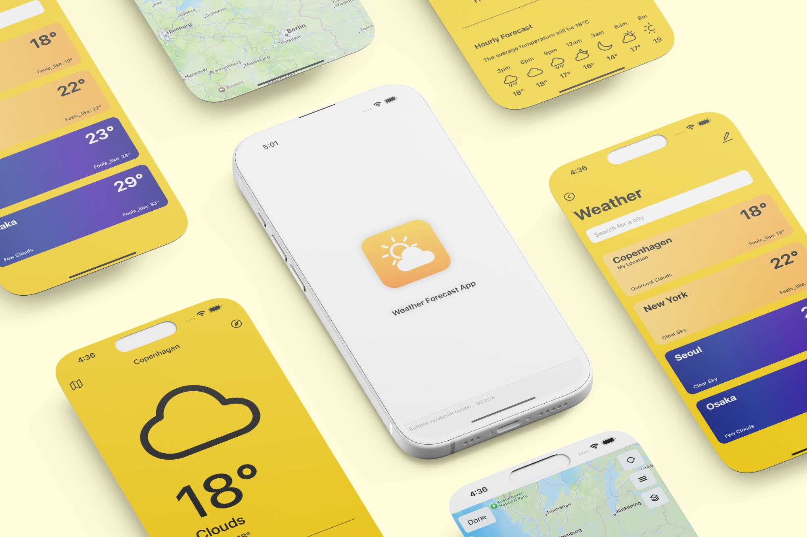
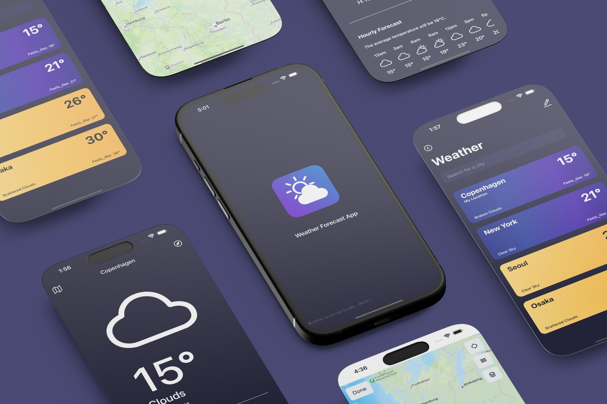

# Weather Forecast App (React Native + Expo)




• [View the app preview](https://expo.dev/preview/update?message=Publishing+Weather+Application&updateRuntimeVersion=1.0.0&createdAt=2025-09-02T00%3A26%3A36.713Z&slug=exp&projectId=bf7b74cf-6294-437a-b78e-c98a17564095&group=79b26f1c-aa42-417c-95b3-12ace4a547cf)

<br /> <br />
## Introduction
A cross-platform weather app for iOS and Android, built with React Native and Expo. 
It provides current, hourly, and daily forecasts. 

The app automatically adjusts its theme according to local sunrise and sunset times, allows users to save their favorite cities, and view them on a map with detailed weather information.

<br /> <br />
## Development Environment
• Client : HTML, React Native + Expo, Nativewind

• Deployment environment : Expo

• Design : Figma, Adobe Illustrator, Adobe Photoshop

## Project structure  
```
.
├── README.md
├── app/
│   ├── +not-found.tsx
│   ├── _layout.tsx
│   ├── index.tsx
│   ├── list.tsx
│   ├── map.tsx
│   └── city/
│       └── [cityID].tsx
├── components/
│   ├── CityHeader.tsx
│   ├── CustomHeader.tsx
│   └── Map/
│       ├── map.tsx
│       ├── map.web.tsx
│       └── map.native.tsx
├── context/
│   ├── EditContext.tsx
│   ├── LocationContext.tsx
│   └── ThemeContext.tsx
├── assets/
│   ├── fonts/SpaceMono-Regular.ttf
│   └── images/...
├── hooks/
│   ├── getLocalDayTime.tsx
│   └── getWeatherIcons.tsx
├── utils/weatherIcon.tsx
├── android/
│   ├── app/
│   │   └── src/main/java/.../MainActivity.kt
│   └── build.gradle
├── ios/
│   └── rnproject/
│       └── AppDelegate.swift
├── app.json
├── tsconfig.json
├── package.json
├── yarn.lock / package-lock.json
├── babel.config.js
├── metro.config.js
├── tailwind.config.js
└── global.css
```


<br /> <br />
## APIs Used  
• OpenWeather API: Provides real-time weather data, including current conditions, forecasts, and other meteorological information.